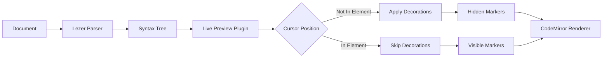
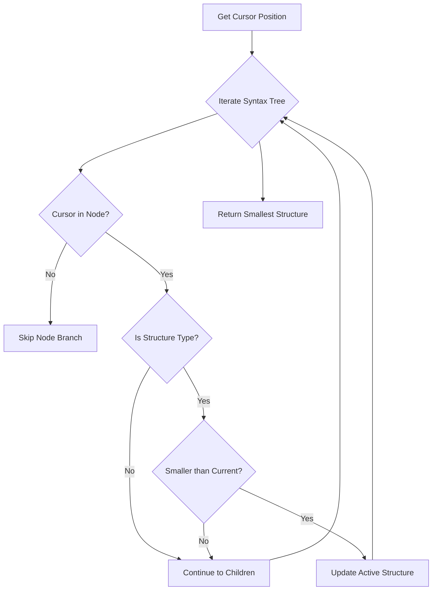
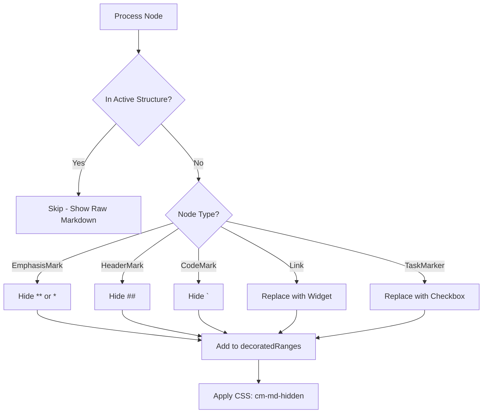
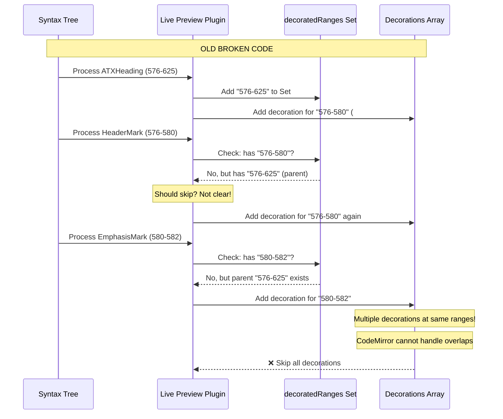
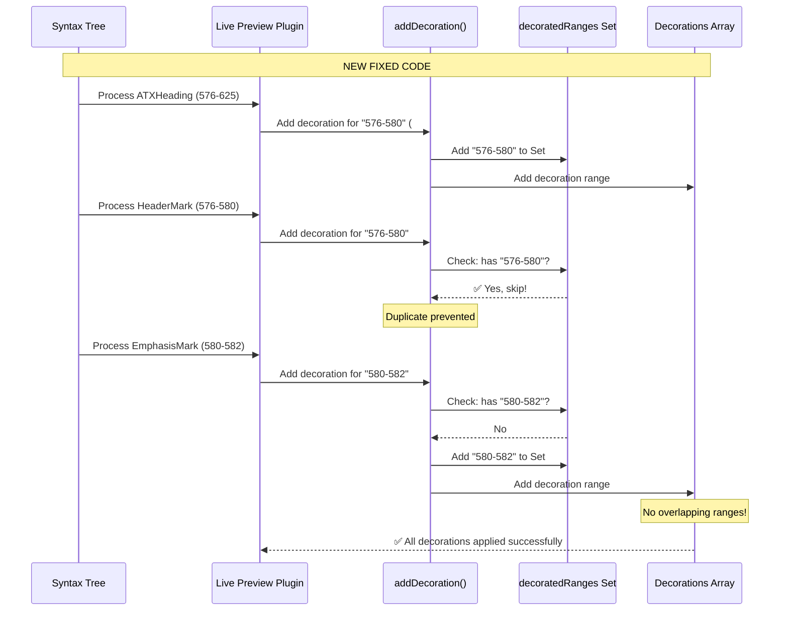

# Live Preview Mode: Architecture & Implementation

**Version:** 1.0
**Date:** November 20, 2025
**Status:** Implemented
**Authors:** fabriqa.ai Engineering Team

---

## Table of Contents

1. [Overview](#overview)
2. [Architecture](#architecture)
3. [How Live Preview Works](#how-live-preview-works)
4. [The Overlapping Decorations Problem](#the-overlapping-decorations-problem)
5. [Solution Implementation](#solution-implementation)
6. [Technical Deep Dive](#technical-deep-dive)
7. [Future Considerations](#future-considerations)

---

## Overview

Live Preview mode provides an **Obsidian-style editing experience** where markdown syntax is hidden except for the specific element the cursor is currently editing. This creates a WYSIWYG-like experience while maintaining full markdown compatibility.

### Key Behaviors

- **Cursor NOT on element**: Syntax hidden, rendered appearance shown
  - `**bold**` → **bold** (no markers visible)
  - `## Heading` → **Heading** (no `##` visible)
  - `[link](url)` → clickable link widget

- **Cursor ON element**: Raw markdown shown for editing
  - `**bold**` → `**bold**` (markers visible)
  - `## Heading` → `## Heading` (`##` visible)
  - `[link](url)` → `[link](url)` (editable text)

### Technology Stack

```mermaid
graph TB
    A[CodeMirror 6] --> B[@codemirror/lang-markdown]
    B --> C[@lezer/markdown v1.2.0]
    C --> D[Syntax Tree Parser]
    A --> E[@codemirror/view]
    E --> F[Decoration System]
    F --> G[Live Preview Plugin]
    G --> H[Markdown Hiding Styles]
```

---

## Architecture

### Component Overview



### File Structure

```
/webview/
├── editors/
│   ├── livePreviewMode.ts          # Main Live Preview plugin
│   └── debug-live-preview.ts       # Debug utilities
├── lib/
│   └── markdown-live-preview/       # Reusable library (future)
│       ├── types.ts
│       ├── cursor-detection.ts
│       ├── decorations.ts
│       ├── plugin.ts
│       └── styles.ts
└── main.ts                          # Editor initialization
```

---

## How Live Preview Works

### 1. Syntax Tree Iteration

CodeMirror uses the **Lezer parser** to create a syntax tree of the markdown document:

```
Document
├─ Paragraph
│  └─ StrongEmphasis (580-610)
│     ├─ EmphasisMark (580-582: "**")
│     ├─ Text (582-608: "The Three-Course Journey:")
│     └─ EmphasisMark (608-610: "**")
└─ ...
```

### 2. Active Structure Detection

The plugin finds the **smallest markdown structure** containing the cursor:



**Structure Types:**
- **Block-level**: `FencedCode`, `ATXHeading1-6`, `Blockquote`, `ListItem`
- **Inline-level**: `Emphasis`, `StrongEmphasis`, `Link`, `InlineCode`, `Strikethrough`

### 3. Decoration Application

For each node in the syntax tree:



### 4. CSS Hiding

The `cm-md-hidden` class applies:

```css
.cm-md-hidden {
  display: none !important;
}
```

This completely hides the markdown syntax markers from view.

---

## The Overlapping Decorations Problem

### The Bug

On **specific lines** (particularly those with nested formatting), bold markers (`**`) remained visible despite decorations being created.

**Example Problem Line:**
```markdown
**The Three-Course Journey:**
```

**HTML Output (BROKEN):**
```html
<div class="cm-line">
  <span class="ͼ8 ͼ4">**</span>
  <span class="ͼ8">The Three-Course Journey:</span>
  <span class="ͼ8 ͼ4">**</span>
</div>
```
❌ No `cm-md-hidden` wrapper - markers visible!

### Root Cause Analysis

Console debugging revealed **5 overlapping decorations**:

```
[LivePreview] Decorations for line 13 area:
['576-580', '576-579', '580-582', '617-619', '621-624']
```

#### Why Overlapping Occurred



**The Issue:**
1. Node-level tracking added entire parent ranges (e.g., `576-625` for heading)
2. Child nodes (e.g., `EmphasisMark` at `580-582`) had different ranges
3. Checking `decoratedRanges.has(rangeKey)` failed because:
   - Parent: `"576-625"` in Set
   - Child: `"580-582"` not in Set → allowed to proceed
4. Multiple nodes created decorations for overlapping positions
5. **CodeMirror skips all decorations when overlaps are detected**

### Visual Representation

```mermaid
gantt
    title Decoration Ranges (BROKEN - Overlapping)
    dateFormat X
    axisFormat %s

    section Decorations
    ATXHeading (576-625)     :576, 625
    HeaderMark (576-580)     :576, 580
    Partial (576-579)        :576, 579
    EmphasisMark (580-582)   :580, 582
    EmphasisMark (617-619)   :617, 619
    Mystery (621-624)        :621, 624

    Note: Overlapping ranges cause CodeMirror to skip ALL decorations
```



---

## Solution Implementation

### The Fix

**Remove node-level range tracking entirely. Only track at the decoration level.**

#### Before (BROKEN):

```typescript
syntaxTree(view.state).iterate({
  enter: (node) => {
    // Check if we've already decorated this range
    const rangeKey = `${node.from}-${node.to}`;
    if (decoratedRanges.has(rangeKey)) {
      return false;  // ❌ Skip entire node
    }

    this.processNode(node, view, decorations);
    decoratedRanges.add(rangeKey);  // ❌ Add entire node range
  }
});
```

**Problem:** Entire node ranges (e.g., `576-625`) added to Set, but decorations use sub-ranges (e.g., `580-582`).

#### After (FIXED):

```typescript
syntaxTree(view.state).iterate({
  enter: (node) => {
    // For all other nodes, apply decorations (hide syntax)
    // Note: We don't check decoratedRanges at the node level anymore,
    // only inside processNode() at the decoration level to prevent duplicates
    this.processNode(node, view, decorations, decoratedRanges);
  }
});
```

**Inside processNode():**

```typescript
processNode(node: SyntaxNode, view: EditorView, decorations: Range<Decoration>[], decoratedRanges: Set<string>): void {
  // Helper function to add decoration only if range not already decorated
  const addDecoration = (decoration: Decoration, from: number, to: number) => {
    const key = `${from}-${to}`;
    if (!decoratedRanges.has(key)) {
      decorations.push(decoration.range(from, to));
      decoratedRanges.add(key);  // ✅ Track EXACT decoration range
    }
  };

  switch (type.name) {
    case 'EmphasisMark':
      if (nodeText.match(/^[*_]+$/)) {
        addDecoration(hiddenDecoration, from, to);  // ✅ Check before adding
      }
      break;
    // ... other cases
  }
}
```

### Why This Works



**Key Changes:**
1. ✅ Every node gets processed (no early returns)
2. ✅ Duplicate prevention at **decoration range level**, not node level
3. ✅ `decoratedRanges` tracks exact decoration positions (e.g., `580-582`)
4. ✅ Multiple nodes can contribute decorations without conflict
5. ✅ CodeMirror receives clean, non-overlapping decoration ranges

### Result

**HTML Output (FIXED):**
```html
<!-- Cursor NOT on line -->
<div class="cm-line">
  <span class="cm-md-hidden"><span class="ͼ8 ͼ4">**</span></span>
  <span class="ͼ8">The Three-Course Journey:</span>
  <span class="cm-md-hidden"><span class="ͼ8 ͼ4">**</span></span>
</div>

<!-- Cursor ON line -->
<div class="cm-activeLine cm-line">
  <span class="ͼ8 ͼ4">**</span>
  <span class="ͼ8">The Three-Course Journey:</span>
  <span class="ͼ8 ͼ4">**</span>
</div>
```
✅ Perfect Obsidian-style behavior!

---

## Technical Deep Dive

### Decoration Types

We use **two main decoration approaches**:

#### 1. `Decoration.mark()` - For Hiding Syntax

```typescript
const hiddenDecoration = Decoration.mark({ class: 'cm-md-hidden' });

// Usage
decorations.push(hiddenDecoration.range(from, to));
```

**Why:** Applies CSS class to existing text, allowing `display: none` to hide it.

#### 2. `Decoration.replace()` - For Widgets

```typescript
decorations.push(
  Decoration.replace({
    widget: new CheckboxWidget(isChecked, view, from)
  }).range(from, to)
);
```

**Why:** Replaces raw markdown with interactive elements (checkboxes, links).

### Active Structure Detection Logic

```typescript
findActiveStructure(view: EditorView, cursorPos: number): SyntaxNode | null {
  let activeStructure: SyntaxNode | null = null;

  syntaxTree(view.state).iterate({
    enter: (node) => {
      // For inline structures: cursor must be STRICTLY inside
      const isInlineStructure = ['Emphasis', 'StrongEmphasis', 'Link', 'InlineCode'].includes(node.type.name);

      let cursorInNode: boolean;
      if (isInlineStructure) {
        // Strict: cursor > from AND cursor < to
        cursorInNode = cursorPos > node.from && cursorPos < node.to;
      } else {
        // Inclusive: cursor >= from AND cursor <= to
        cursorInNode = cursorPos >= node.from && cursorPos <= node.to;
      }

      if (!cursorInNode) {
        return false; // Skip this branch
      }

      if (structureTypes.includes(node.type.name)) {
        // Keep the smallest (most specific) structure
        if (!activeStructure || (node.to - node.from) < (activeStructure.to - activeStructure.from)) {
          activeStructure = node.node;
        }
      }

      return true; // Continue exploring children
    }
  });

  return activeStructure;
}
```

**Why Strict for Inline?**
- Prevents edge case issues when cursor is between two inline elements
- Example: `**bold1** text **bold2**` with cursor at `|text` (not in either bold)
- Strict containment ensures clear boundaries

### Performance Optimizations

1. **Single Tree Iteration**: One pass through syntax tree per update
2. **Set-based Deduplication**: O(1) lookup for duplicate ranges
3. **Early Returns**: Skip entire branches when cursor is in active structure
4. **Viewport-aware**: Only processes visible content

---

## Future Considerations

### Potential Improvements

1. **Performance Profiling**
   - Measure decoration build time on large documents (1000+ lines)
   - Consider caching decorations for unchanged viewport ranges

2. **Advanced Hiding Techniques**
   - Alternative to `display: none`: `font-size: 1px; letter-spacing: -1ch; color: transparent`
   - Allows accessibility tools to still read the markers

3. **Configuration Options**
   - Allow users to toggle which syntax gets hidden
   - Per-element hiding preferences (e.g., always show `##` but hide `**`)

4. **Library Extraction**
   - Complete the `/webview/lib/markdown-live-preview/` library
   - Make reusable for other CodeMirror projects

5. **Multi-cursor Support**
   - Handle multiple active structures when multiple cursors exist
   - Show syntax for all cursor positions

### Known Limitations

1. **Parser Dependency**: Relies on `@lezer/markdown` v1.2.0 syntax tree structure
2. **Custom Markdown**: Non-standard markdown extensions may not be recognized
3. **Performance**: Very large documents (5000+ lines) may see lag on decoration updates

### Debug Utilities

For future debugging, use the `debugSyntaxTree()` utility:

```typescript
import { debugSyntaxTree } from './editors/debug-live-preview';

// In buildDecorations()
debugSyntaxTree(view, lineNumber);
```

**Output:**
```
=== Syntax Tree for Line 13 ===
Text: "**The Three-Course Journey:**"
Range: 580-610

Nodes:
  Document (0-1234): "..."
    Paragraph (575-610): "..."
      StrongEmphasis (580-610): "**The Three-Course Journey:**"
        EmphasisMark (580-582): "**"
        Text (582-608): "The Three-Course Journey:"
        EmphasisMark (608-610): "**"
=== End Syntax Tree ===
```

---

## Conclusion

The Live Preview mode implementation demonstrates:

- ✅ **Obsidian-style UX**: Granular syntax hiding at element level
- ✅ **Robust Architecture**: Clean separation of concerns
- ✅ **Problem Solving**: Overlapping decorations issue resolved through precise range tracking
- ✅ **Maintainability**: Well-documented code with debug utilities
- ✅ **Performance**: Single-pass tree iteration with O(1) deduplication

This architecture provides a solid foundation for future enhancements while maintaining code quality and user experience.

---

## References

- [CodeMirror 6 Documentation](https://codemirror.net/docs/)
- [Lezer Parser System](https://lezer.codemirror.net/)
- [Obsidian Live Preview](https://obsidian.md/)
- [codemirror-rich-markdoc](https://github.com/benrbray/codemirror-rich-markdoc) (inspiration)

---

**Document Version:** 1.0
**Last Updated:** November 20, 2025
**Maintained By:** fabriqa.ai Engineering Team
