# Mermaid Diagram Test

This document tests various Mermaid diagram types in the fabriqa.ai Markdown Editor.

## Flowchart

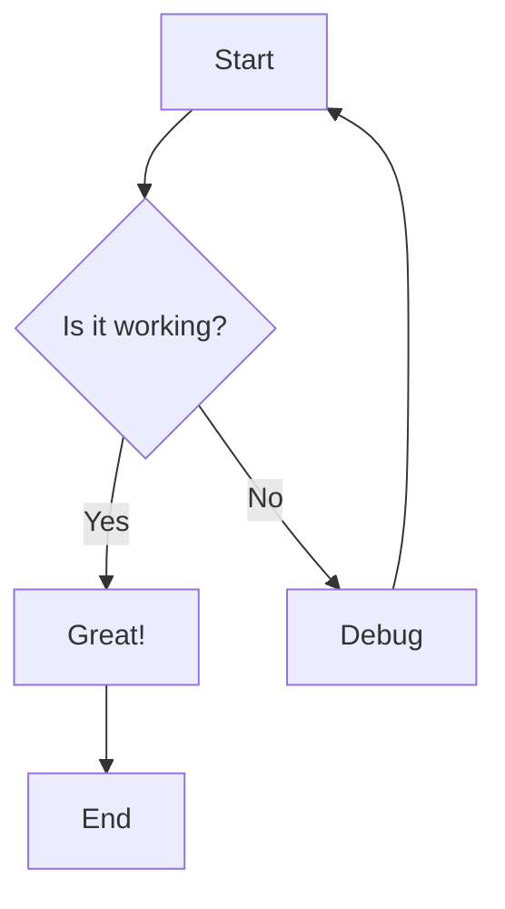

## Sequence Diagram

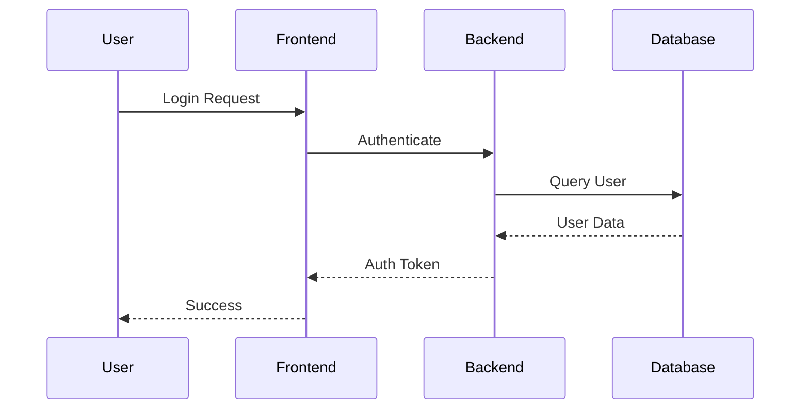

## Class Diagram

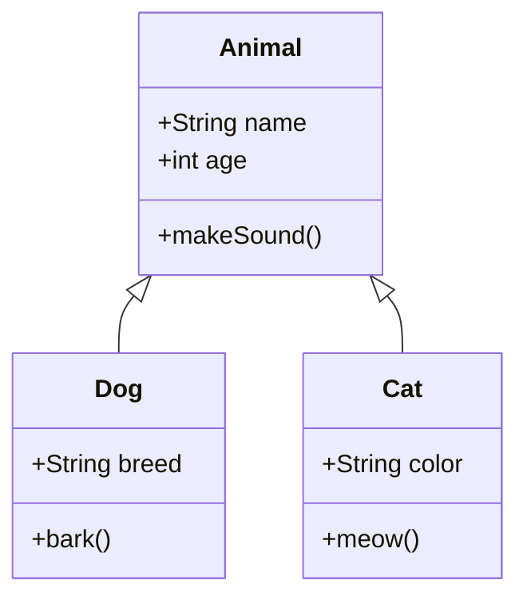

## State Diagram

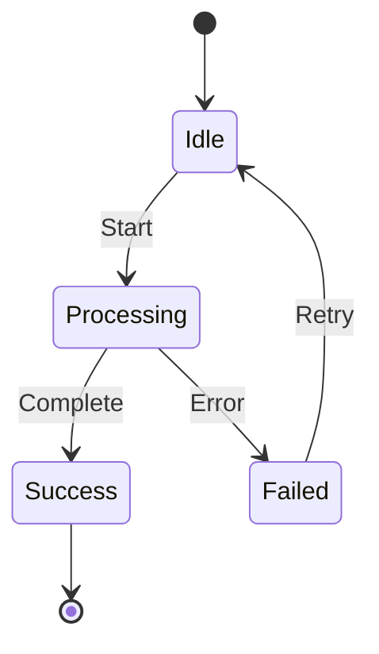

## ER Diagram

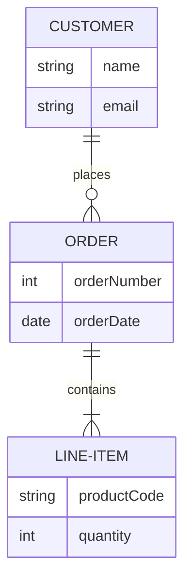

## Gantt Chart

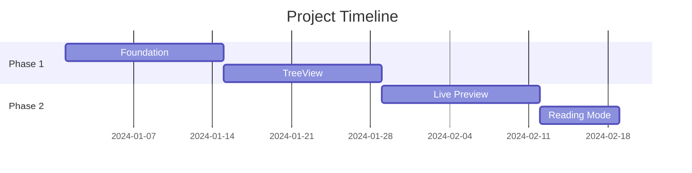

## Pie Chart

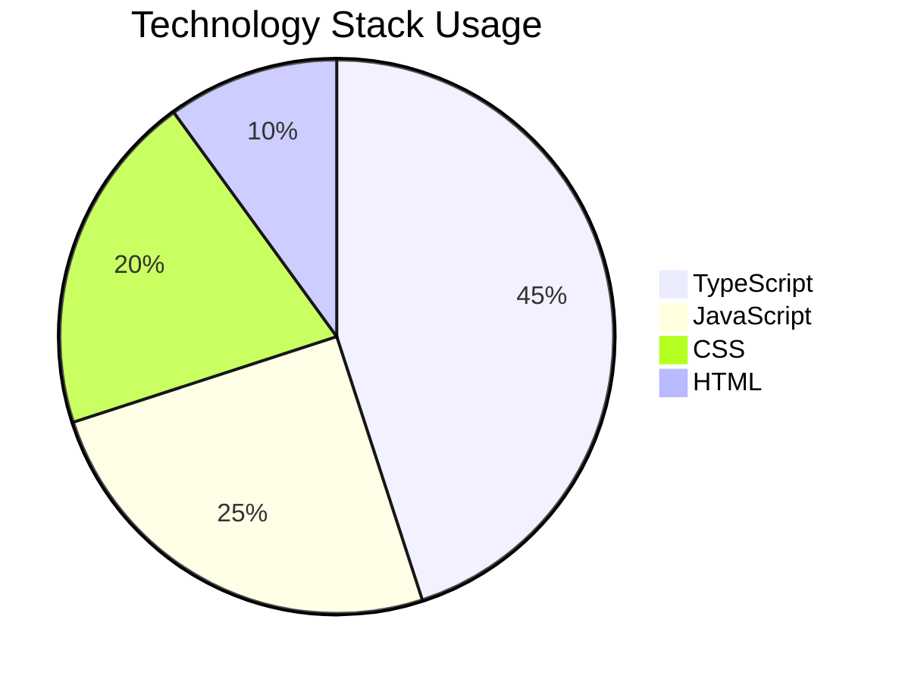

## Git Graph

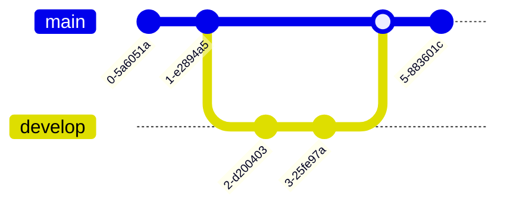

## Mind Map

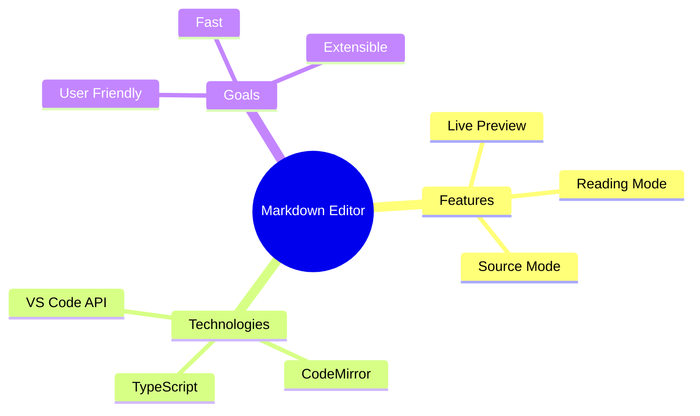

## Timeline

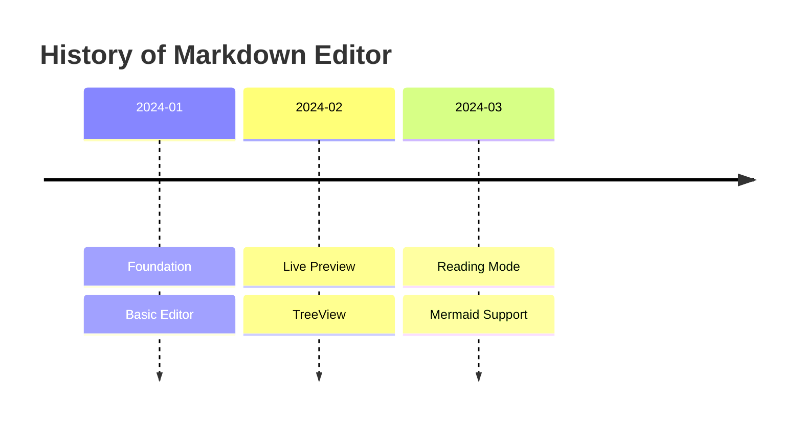

## Invalid Syntax Test

This should show an error:

```mermaid
invalid syntax here
this will fail
```

## Simple Flowchart Test

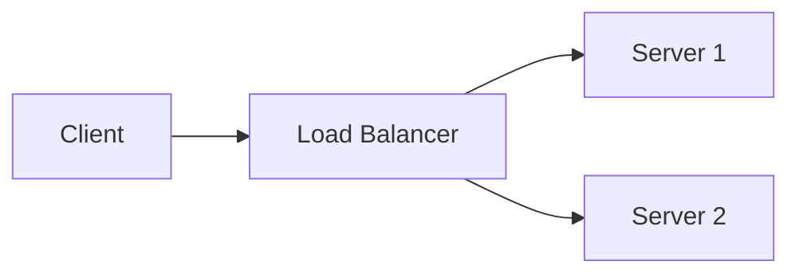

---

## Instructions

**In Live Preview Mode:**
- Diagrams should render automatically when cursor is outside the code block
- Hover over a diagram to see "View Code" button
- Click "View Code" to edit the source
- Click outside or move cursor away to return to diagram view

**In Reading Mode:**
- All diagrams should be fully rendered
- Invalid syntax should show error message with code view option

**In Source Mode:**
- Raw markdown syntax is always visible
