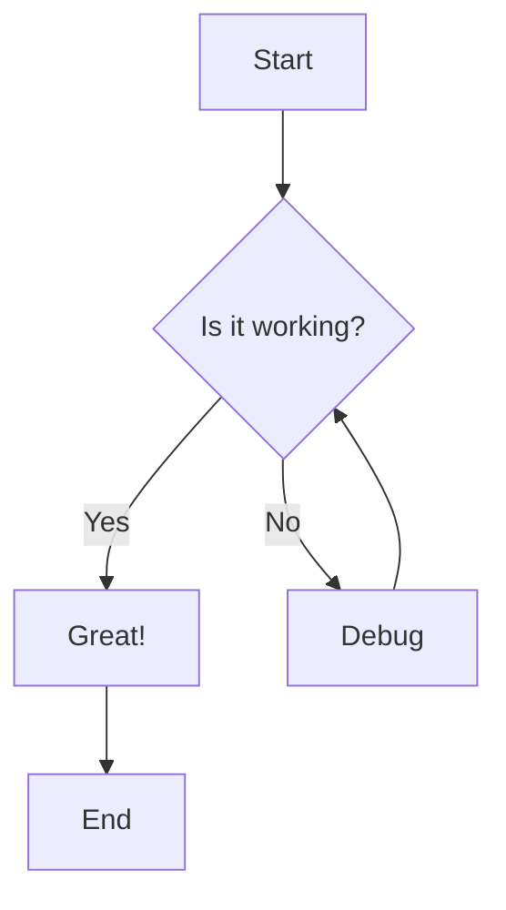
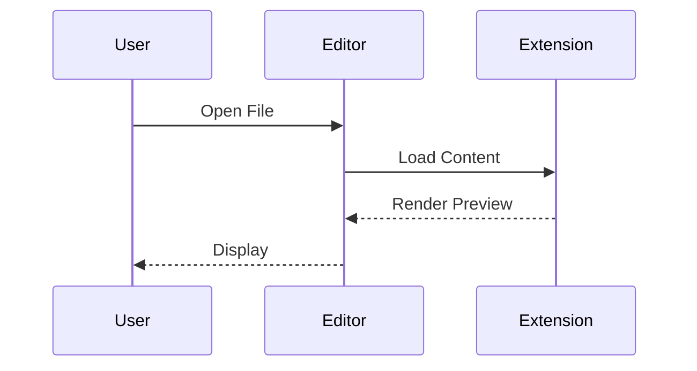
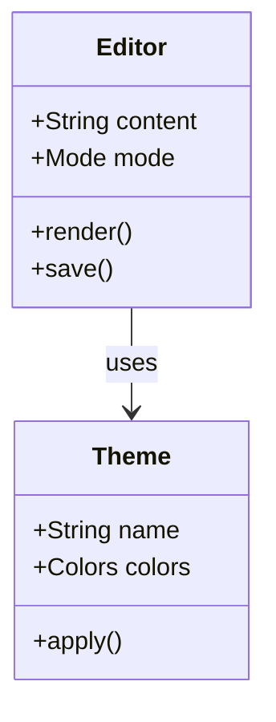
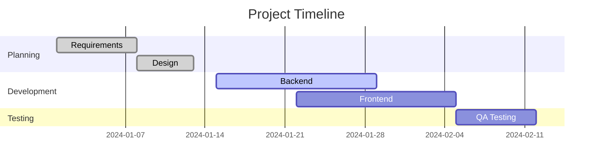
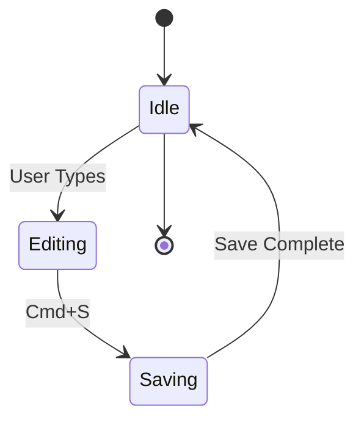
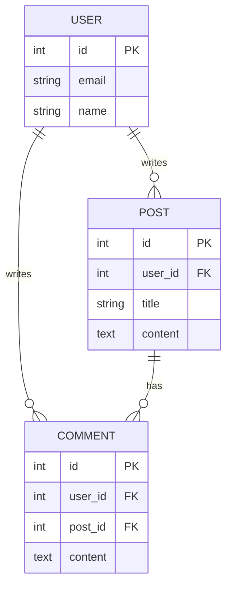

# fabriqa.ai Markdown Editor - Feature Showcase

This document demonstrates all supported markdown features in the fabriqa.ai markdown editor.

---

## Headings

# H1 Heading
## H2 Heading
### H3 Heading
#### H4 Heading
##### H5 Heading
###### H6 Heading

---

## Text Formatting

**Bold text** using double asterisks or __double underscores__

*Italic text* using single asterisks or _single underscores_

***Bold and italic*** using triple asterisks

~~Strikethrough text~~ using double tildes

---

## Lists

### Unordered Lists

- Item 1
- Item 2
  - Nested item 2.1
  - Nested item 2.2
- Item 3

### Ordered Lists

1. First item
2. Second item
   1. Nested item 2.1
   2. Nested item 2.2
3. Third item

### Task Lists

- [ ] Unchecked task
- [x] Completed task
- [ ] Another unchecked task
  - [x] Nested completed task
  - [ ] Nested unchecked task

---

## Links

[Visit fabriqa.ai](https://fabriqa.ai)

[GitHub Repository](https://github.com/hancengiz/fabriqa.ai-markdown-editor)

[Relative link to design doc](./design.md)

---

## Images


---

## Code

### Inline Code

Use `const variable = value` for inline code.

The `npm install` command installs dependencies.

### Code Blocks

```javascript
function greet(name) {
  console.log(`Hello, ${name}!`);
  return `Welcome to fabriqa.ai`;
}

greet('Developer');
```

```python
def fibonacci(n):
    if n <= 1:
        return n
    return fibonacci(n-1) + fibonacci(n-2)

print(fibonacci(10))
```

```typescript
interface User {
  id: number;
  name: string;
  email: string;
}

const createUser = (data: User): User => {
  return { ...data };
};
```

---

## Blockquotes

> This is a simple blockquote.
> It can span multiple lines.
>
> And include multiple paragraphs.

> Nested blockquotes are also supported.
>> This is nested inside another quote.
>>> And this is triple-nested!

---

## GitHub Alerts

> [!NOTE]
> Useful information that users should know, even when skimming content.

> [!TIP]
> Helpful advice for doing things better or more easily.

> [!IMPORTANT]
> Key information users need to know to achieve their goal.

> [!WARNING]
> Urgent info that needs immediate user attention to avoid problems.

> [!CAUTION]
> Advises about risks or negative outcomes of certain actions.

---

## Horizontal Rules

You can create horizontal rules using three or more:

Hyphens:
---

Asterisks:
***

Underscores:
___

---

## Mermaid Diagrams

### Flowchart



### Sequence Diagram



### Class Diagram



### Gantt Chart



### State Diagram



### ER Diagram



---

## Tables

| Feature | Status | Priority |
|---------|--------|----------|
| Live Preview | ✅ Complete | High |
| Source Mode | ✅ Complete | High |
| Reading Mode | ✅ Complete | Medium |
| GitHub Alerts | ✅ Complete | High |
| Image Rendering | ✅ Complete | High |
| Horizontal Rules | ✅ Complete | Low |
| Mermaid Diagrams | ✅ Complete | Medium |

---

## Combined Features

You can combine multiple features together:

### Task List with Formatting

- [x] **Bold task** completed
- [ ] *Italic task* pending
- [x] Task with `inline code`
- [ ] Task with [link](https://example.com)

### Blockquote with Code

> Here's a code example inside a blockquote:
>
> ```javascript
> const example = 'code in quote';
> console.log(example);
> ```

### Alert with List

> [!TIP]
> Follow these steps:
> 1. Install the extension
> 2. Open a markdown file
> 3. Start editing!

---

## Editor Modes

The fabriqa.ai markdown editor supports three modes:

1. **Live Preview Mode** (Cmd+Shift+P)
   - Edit and see rendered output simultaneously
   - Obsidian-style inline editing
   - Hide syntax when not editing

2. **Source Mode** (Cmd+Shift+S)
   - Raw markdown editing
   - Full syntax visibility
   - Traditional text editor experience

3. **Reading Mode** (Cmd+Shift+R)
   - Read-only rendered view
   - Clean, distraction-free reading
   - No editing capabilities

---

## Keyboard Shortcuts

### Mode Switching
- `Cmd+Shift+P` - Live Preview Mode
- `Cmd+Shift+S` - Source Mode
- `Cmd+Shift+R` - Reading Mode

### Formatting (Cmd+Alt+Key)
- `Cmd+Alt+B` - **Bold**
- `Cmd+Alt+I` - *Italic*
- `Cmd+Alt+C` - `Inline Code`
- `Cmd+Alt+X` - ~~Strikethrough~~
- `Cmd+Alt+K` - [Link]()
- `Cmd+Alt+E` - Code Block
- `Cmd+Alt+H` - Toggle Heading
- `Cmd+Alt+Q` - Blockquote
- `Cmd+Alt+T` - Task Checkbox
- `Cmd+Alt+7` - Numbered List
- `Cmd+Alt+8` - Bullet List

### Search
- `Cmd+F` - Find
- `F3` - Find Next
- `Shift+F3` - Find Previous
- `Esc` - Clear Find

---

## Additional Features

### Interactive Elements

- ✅ **Clickable Checkboxes** - Click to toggle task completion
- 🔗 **Cmd+Click Links** - Open markdown files in editor
- 🖼️ **Image Preview** - Inline image rendering
- 📊 **Live Mermaid** - Interactive diagram rendering

### Theme Support

- Light theme (VS Code Light)
- Dark theme support ready
- Customizable color schemes
- Consistent styling across modes

### Performance

- Fast rendering for large documents
- Efficient decoration system
- Smooth live preview updates
- Optimized syntax highlighting

---

## Coming Soon

Features planned for future releases:

- [ ] Table editing support
- [ ] Footnotes
- [ ] Emoji shortcodes (:smile:)
- [ ] HTML tag support
- [ ] Math equations (LaTeX)
- [ ] Syntax highlighting for code blocks
- [ ] Export to PDF/HTML
- [ ] Custom themes

---

*Built with ❤️ by fabriqa.ai*
