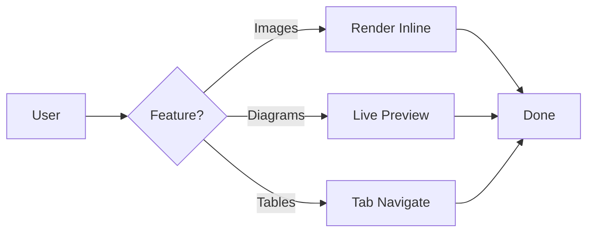

# Additional Features

This demonstrates additional features and capabilities of fabriqa.ai Markdown Editor.

---

## Interactive Elements

### ✅ Clickable Checkboxes

Task list checkboxes are fully interactive:
- Click to toggle completion
- Works in Live Preview mode
- Works in Reading mode
- State persists in the document

Example:
- [ ] Click me to complete
- [x] Click me to uncomplete

---

### 🔗 Cmd+Click Links

Links are interactive with Cmd/Ctrl+Click:
- **Markdown files** open in the editor
- **External URLs** open in your browser
- **Relative paths** resolve correctly
- No need to leave your workflow

Example:
[Click this link](https://fabriqa.ai)

---

### 🖼️ Image Preview

Images render inline with smart features:
- Automatic sizing (max-width: 100%)
- Rounded corners for elegance
- Alt text as tooltip
- Error handling for broken images
- Obsidian-style editing (show markdown when editing)

Example:

Try placing your cursor inside the image markdown above to see the Obsidian-style editing in action!

---

### 📊 Live Mermaid Diagrams

Interactive diagram rendering:
- Real-time rendering
- Click inside to edit
- Click outside to view
- Supports all Mermaid diagram types
- Search-aware (shows code when searching)

Example:

Click inside the mermaid code block to edit, click outside to see the rendered diagram!

---

## Theme Support

### Current Themes
- ✅ **Light theme** (VS Code Light)
- 🔄 **Dark theme** (ready for implementation)

### Theme Features
- Consistent styling across modes
- Proper contrast ratios
- Accessible color schemes
- Smooth transitions

### Customizable Elements
- Background colors
- Text colors
- Border colors
- Code block styling
- Alert colors
- Checkbox appearance

---

## Performance

### Optimizations
- **Fast rendering** for large documents
- **Efficient decoration system** - minimal overhead
- **Smooth live preview updates** - no lag
- **Optimized syntax highlighting**
- **Lazy loading** for complex elements

### Scalability
- Handles documents with 1000+ lines
- Multiple mermaid diagrams
- Many images
- Large tables
- Complex nested structures

---

## Document Management

### Sidebar Tree View
- Browse all markdown files
- Organized by sections
- Quick file access
- File operations (create, rename, delete)

### File Operations
- Create new files
- Rename files
- Delete files
- Refresh tree view

---

## Developer Tools

### Webview Console Logs
Access via command palette:
- View all console messages
- Debug rendering issues
- Monitor performance
- Track errors

### Debug Logging
Enable in settings:
- Detailed operation logs
- File system operations
- Decoration changes
- Performance metrics

---

## Accessibility

### Features
- Keyboard navigation
- Screen reader support
- High contrast themes
- Focus indicators
- Semantic HTML

---

## Coming Soon

Features planned for future releases:

- [ ] Footnotes support
- [ ] Emoji shortcodes (:smile:)
- [ ] HTML tag support
- [ ] Math equations (LaTeX)
- [ ] Syntax highlighting for code blocks
- [ ] Export to PDF/HTML
- [ ] Custom themes
- [ ] Multi-file search
- [ ] Outline view
- [ ] Link validation

---

*Part of fabriqa.ai Markdown Editor Feature Showcase*
