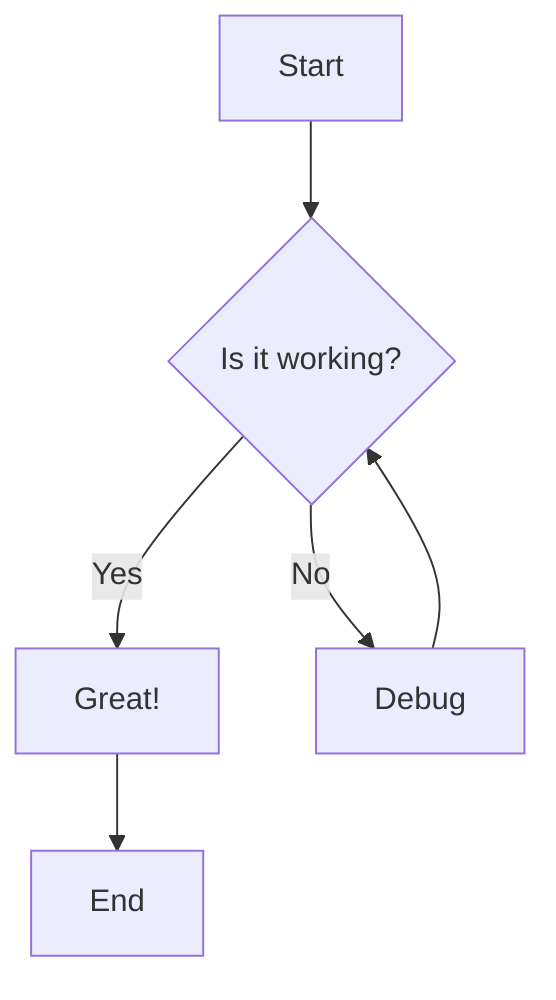
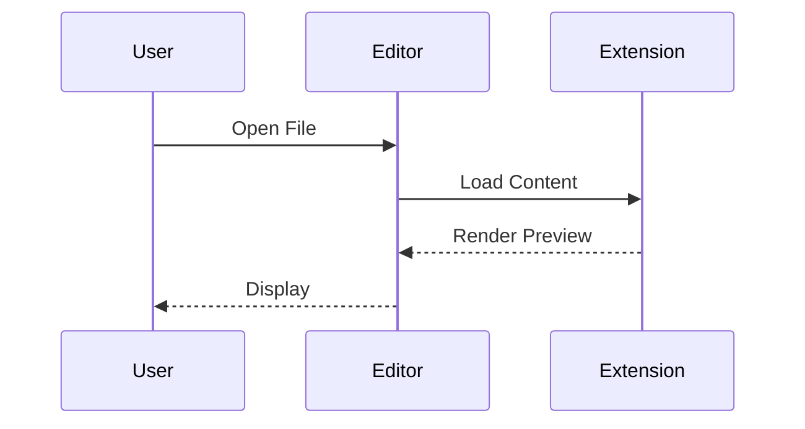
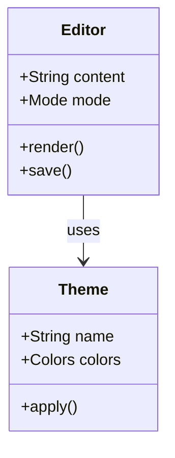
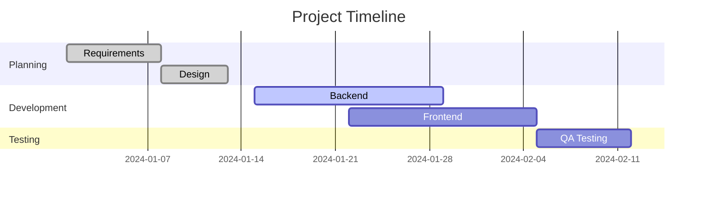
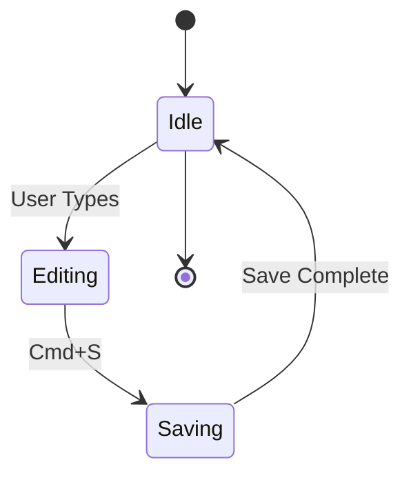
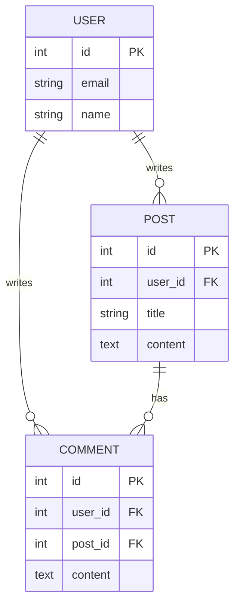
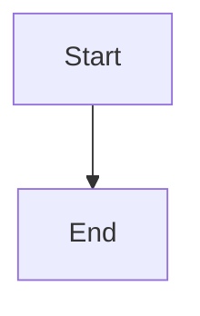

# Mermaid Diagrams

This demonstrates Mermaid diagram rendering for various diagram types.

---

## Flowchart



---

## Sequence Diagram



---

## Class Diagram



---

## Gantt Chart



---

## State Diagram



---

## Entity Relationship Diagram



---

## Features

- **Live Rendering**: Diagrams render automatically
- **Interactive**: Diagrams are fully interactive
- **Obsidian-Style**: Click inside to see/edit code, click outside to see diagram
- **Search Support**: Code becomes visible when search matches inside diagram
- **All Diagram Types**: Supports flowcharts, sequence, class, Gantt, state, ER, and more

---

## Obsidian-Style Editing

In **Live Preview** mode:
- When cursor is **outside**: Beautiful rendered diagram
- When cursor is **inside**: Raw mermaid code visible for editing
- When **searching**: Code visible if search matches inside
- This allows seamless editing and viewing

---

## Syntax

````markdown

````

---

*Part of fabriqa.ai Markdown Editor Feature Showcase*
