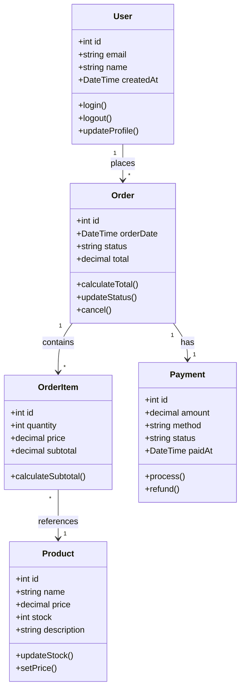
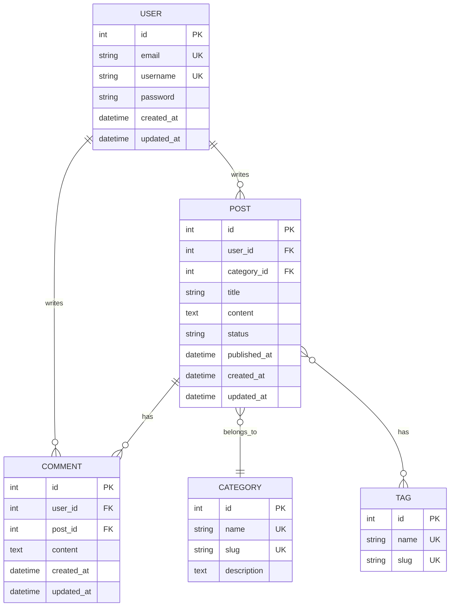
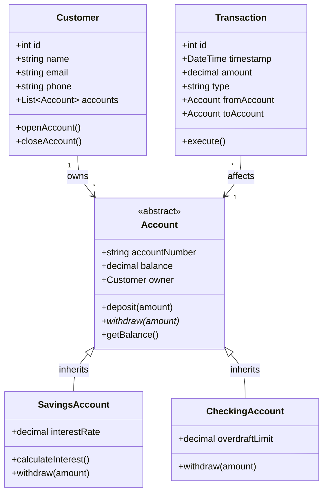
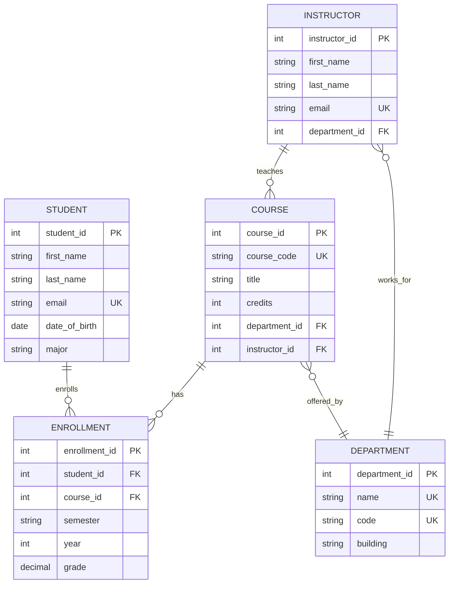

# Mermaid Class & ER Diagram Examples

This document demonstrates class diagrams and entity-relationship diagrams.

## E-Commerce Class Diagram

## Blog System ER Diagram

## Banking System Class Diagram

## University Database ER Diagram

