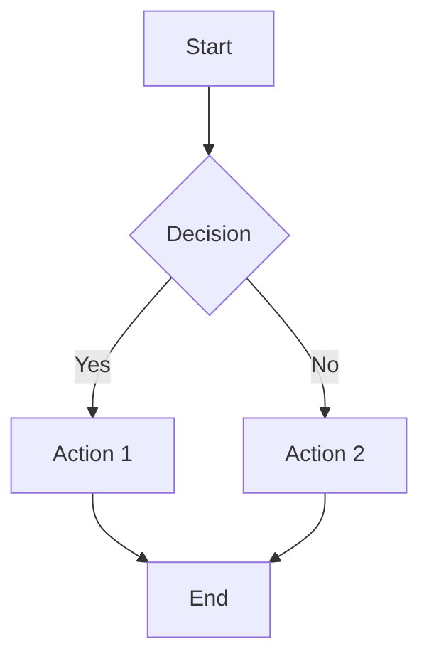
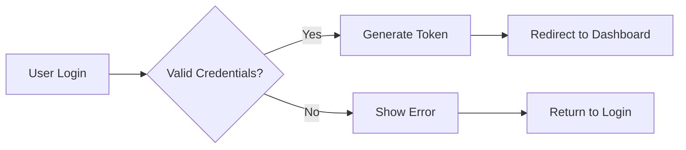
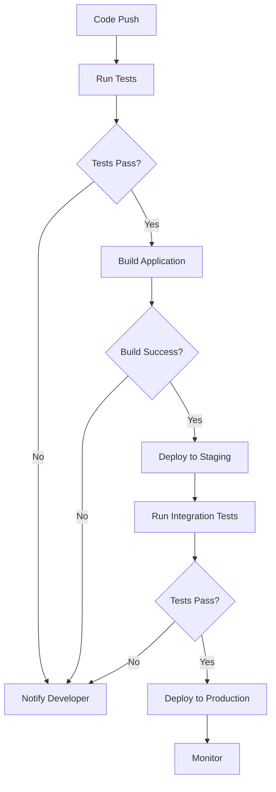
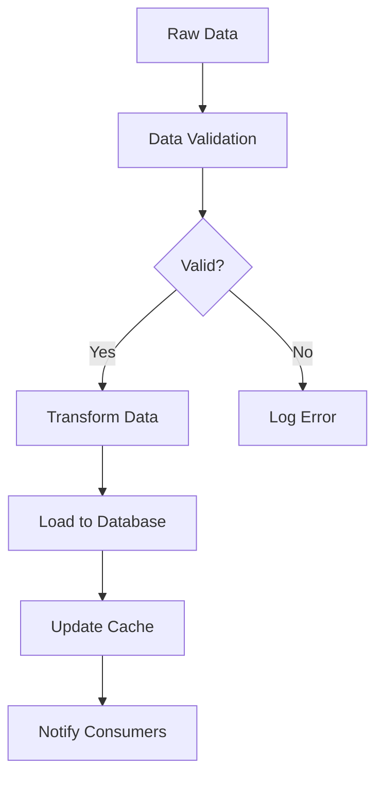

# Mermaid Flowchart Example

This document demonstrates various Mermaid flowchart diagrams.

## Basic Flowchart

```mermaid
graph TD
    A[Start] --> B{Decision}
    B -->|Yes| C[Action 1]
    B -->|No| D[Action 2]
    C --> E[End]
    D --> E
```

## User Authentication Flow

```mermaid
graph LR
    A[User Login] --> B{Valid Credentials?}
    B -->|Yes| C[Generate Token]
    B -->|No| D[Show Error]
    C --> E[Redirect to Dashboard]
    D --> F[Return to Login]
```

## CI/CD Pipeline

```mermaid
graph TD
    A[Code Push] --> B[Run Tests]
    B --> C{Tests Pass?}
    C -->|Yes| D[Build Application]
    C -->|No| E[Notify Developer]
    D --> F{Build Success?}
    F -->|Yes| G[Deploy to Staging]
    F -->|No| E
    G --> H[Run Integration Tests]
    H --> I{Tests Pass?}
    I -->|Yes| J[Deploy to Production]
    I -->|No| E
    J --> K[Monitor]
```

## Data Processing Pipeline

```mermaid
graph TB
    A[Raw Data] --> B[Data Validation]
    B --> C{Valid?}
    C -->|Yes| D[Transform Data]
    C -->|No| E[Log Error]
    D --> F[Load to Database]
    F --> G[Update Cache]
    G --> H[Notify Consumers]
```
