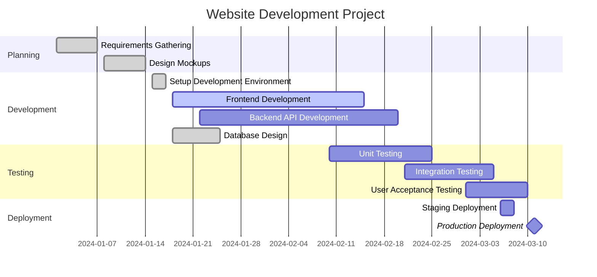
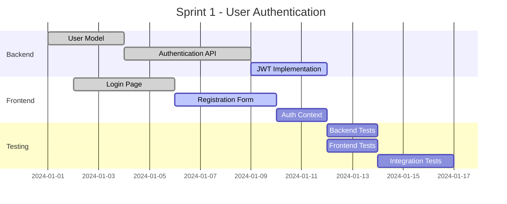
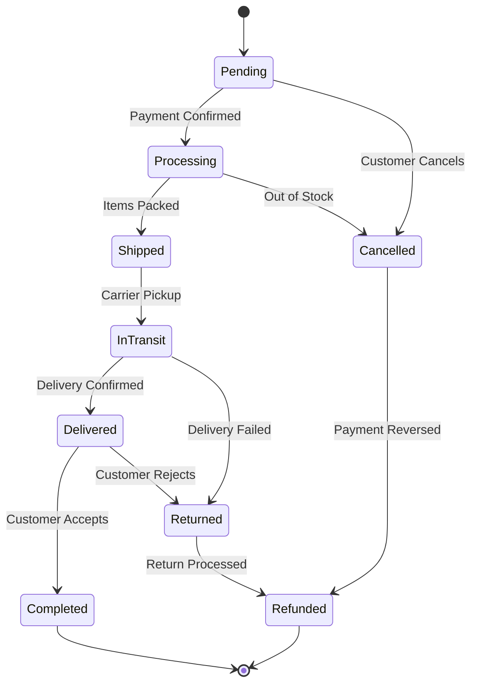
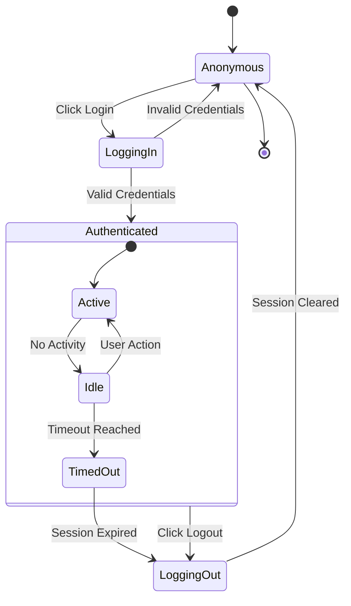
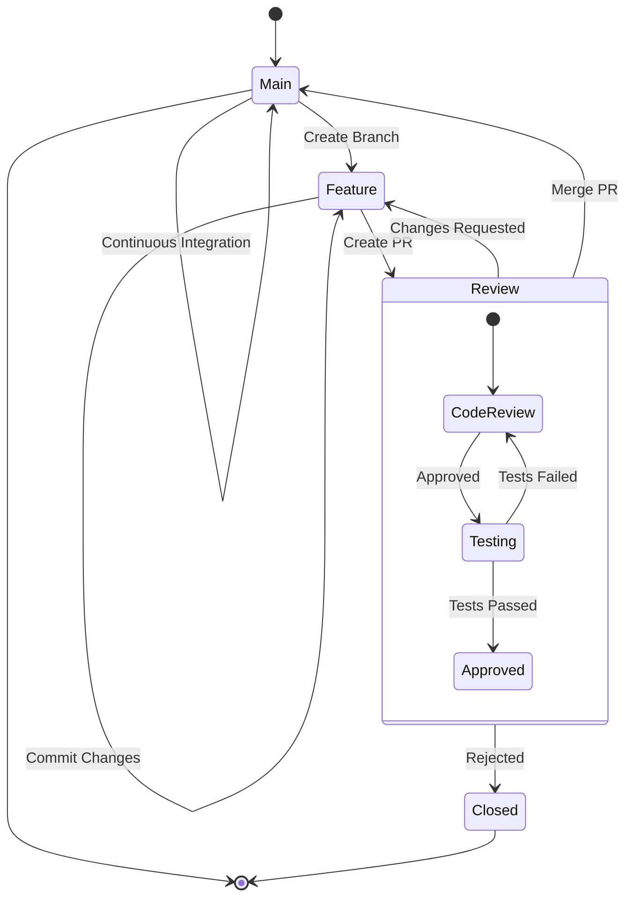
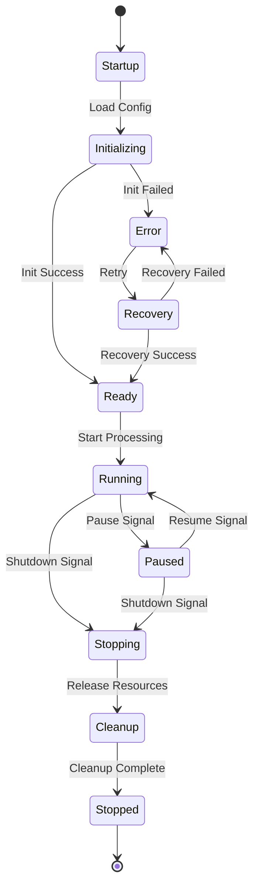

# Mermaid Gantt & State Diagram Examples

This document demonstrates Gantt charts and state diagrams.

## Project Timeline - Gantt Chart

## Sprint Planning - Gantt Chart

## Order Processing State Machine

## User Session State

## Git Workflow State Diagram

## Application Lifecycle States

