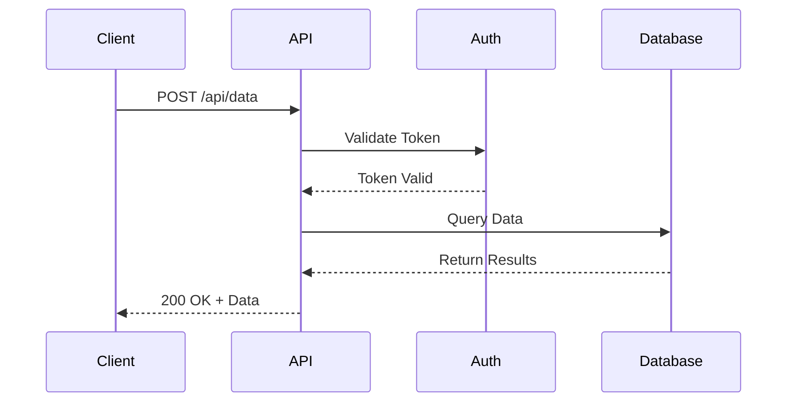
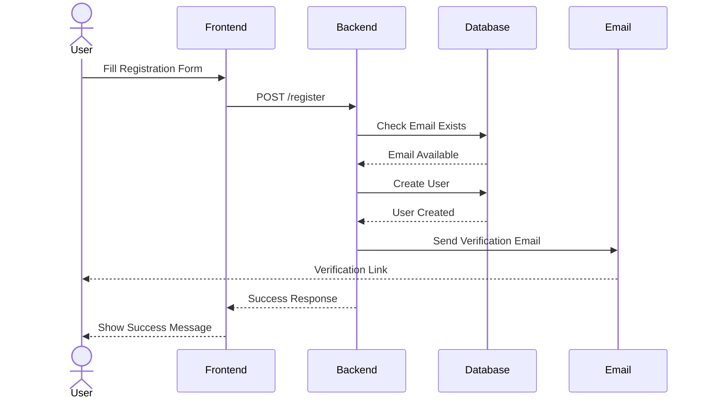
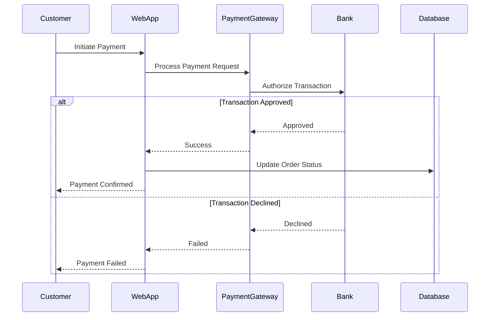
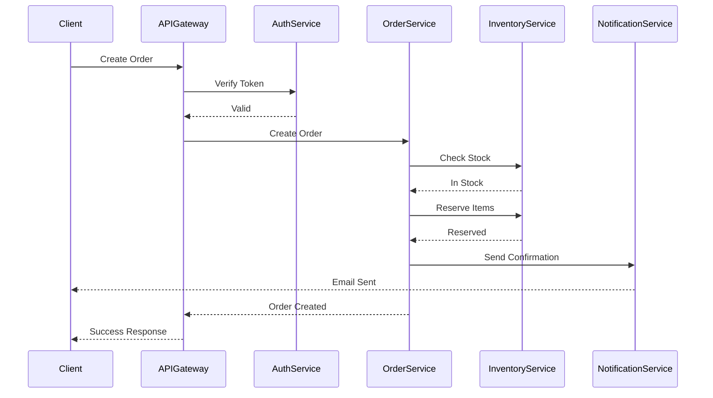

# Mermaid Sequence Diagram Examples

This document demonstrates Mermaid sequence diagrams for various scenarios.

## API Request Flow

## User Registration Process

## Payment Processing

## Microservices Communication

