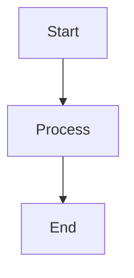
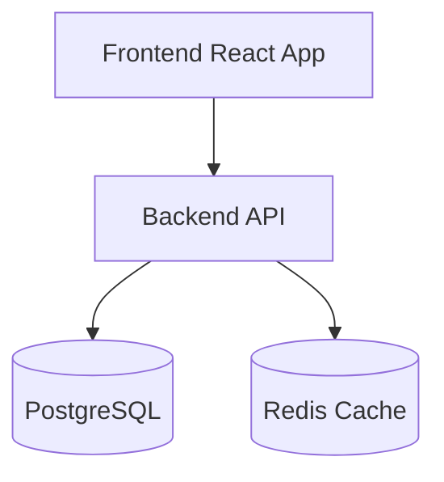
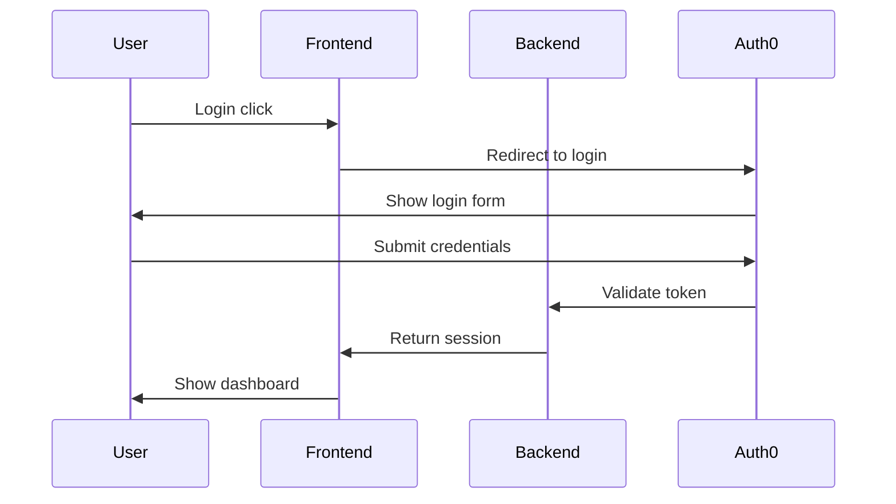

# Task: Interactive Mermaid Diagrams in Live Preview Mode

## Overview
Implement interactive Mermaid diagram rendering in Live Preview mode with toggle functionality between diagram view and code view. This provides a seamless editing experience where diagrams are rendered by default, but users can easily switch to code view for editing.

## Problem Statement
Currently, the basic Mermaid support task (see `mermaid-support-task.md`) only renders Mermaid diagrams in Reading Mode. For Live Preview mode, we need:
- Mermaid code blocks should render as **diagrams by default** (not code)
- A **"View Code" button** in the top-right corner of each diagram
- **Toggle functionality** to switch between diagram and code view
- **Click outside behavior** - clicking outside the code view returns to diagram view
- **Obsidian-style interaction** - smooth transitions and intuitive UX

## User Experience Flow

### Initial State
```markdown

```

**What user sees in Live Preview:**
- A fully rendered Mermaid diagram (not code)
- A small "View Code" icon/button in the top-right corner
- Hover effect on the icon

### Interaction Flow

1. **User clicks "View Code" icon**
   - Diagram smoothly transitions to code block
   - Code is now editable (syntax highlighting active)
   - Icon changes to "View Diagram" or a close icon
   - Focus is placed in the code editor

2. **User edits the Mermaid code**
   - Normal code editing experience
   - Syntax highlighting for Mermaid
   - No auto-rerendering while editing (to avoid disruption)

3. **User clicks outside the code block**
   - Code is validated and re-rendered as diagram
   - If invalid, show error overlay on diagram with validation message
   - Smooth transition back to diagram view
   - Icon returns to "View Code" state

### Edge Cases

- **Invalid Mermaid syntax**: Show error message overlay on diagram, keep "View Code" button visible
- **Empty diagram**: Show placeholder with "Click to add diagram"
- **Very large diagrams**: Consider zoom controls or scrollable container
- **Cursor in code when rendering**: Preserve cursor position if user returns to code view

## Technical Requirements

### 1. Widget-Based Rendering (Recommended Approach)

Use CodeMirror widgets to replace Mermaid code blocks with rendered diagrams:

```typescript
class MermaidDiagramWidget extends WidgetType {
  constructor(
    readonly code: string,
    readonly view: EditorView,
    readonly from: number,
    readonly to: number
  ) {
    super();
  }

  toDOM() {
    // Create container with diagram + "View Code" button
    // Handle click events for toggling
  }

  ignoreEvent(event: Event) {
    // Handle widget-specific events
  }
}
```

### 2. State Management

Track which diagrams are in "code view" vs "diagram view":

```typescript
interface MermaidState {
  [blockId: string]: {
    mode: 'diagram' | 'code';
    lastRendered: string;
    error: string | null;
  };
}
```

### 3. Mermaid Rendering

```typescript
import mermaid from 'mermaid';

// Initialize once
mermaid.initialize({
  startOnLoad: false,
  theme: 'default', // or 'dark' based on VS Code theme
  securityLevel: 'loose',
});

// Render diagram
async function renderMermaidDiagram(code: string, elementId: string) {
  try {
    const { svg } = await mermaid.render(elementId, code);
    return { svg, error: null };
  } catch (error) {
    return { svg: null, error: error.message };
  }
}
```

### 4. Toggle Button Component

```typescript
function createToggleButton(
  currentMode: 'diagram' | 'code',
  onClick: () => void
): HTMLElement {
  const button = document.createElement('button');
  button.className = 'mermaid-toggle-btn';
  button.innerHTML = currentMode === 'diagram'
    ? '<svg>...</svg> View Code'
    : '<svg>...</svg> View Diagram';
  button.addEventListener('click', onClick);
  return button;
}
```

### 5. CSS Styling

```css
.mermaid-diagram-container {
  position: relative;
  border: 1px solid var(--vscode-panel-border);
  border-radius: 4px;
  padding: 16px;
  background: var(--vscode-editor-background);
}

.mermaid-toggle-btn {
  position: absolute;
  top: 8px;
  right: 8px;
  background: var(--vscode-button-background);
  color: var(--vscode-button-foreground);
  border: none;
  border-radius: 3px;
  padding: 4px 8px;
  font-size: 11px;
  cursor: pointer;
  display: flex;
  align-items: center;
  gap: 4px;
  opacity: 0.7;
  transition: opacity 0.2s;
}

.mermaid-toggle-btn:hover {
  opacity: 1;
  background: var(--vscode-button-hoverBackground);
}

.mermaid-diagram-container svg {
  max-width: 100%;
  height: auto;
}

.mermaid-error-overlay {
  position: absolute;
  top: 0;
  left: 0;
  right: 0;
  bottom: 0;
  background: rgba(255, 0, 0, 0.1);
  border: 2px solid var(--vscode-errorForeground);
  display: flex;
  align-items: center;
  justify-content: center;
  padding: 16px;
}

.mermaid-error-message {
  background: var(--vscode-inputValidation-errorBackground);
  color: var(--vscode-inputValidation-errorForeground);
  padding: 8px 12px;
  border-radius: 3px;
  font-family: var(--vscode-editor-font-family);
  font-size: 12px;
}
```

## Implementation Steps

### Phase 1: Basic Diagram Rendering (4-6 hours)

1. **Install mermaid dependency**
   ```bash
   npm install mermaid@^10.0.0
   ```

2. **Create MermaidDiagramWidget**
   - Extend `WidgetType` from CodeMirror
   - Implement `toDOM()` to render diagram
   - Add basic error handling

3. **Integrate with livePreviewMode.ts**
   - Detect `FencedCode` nodes with `mermaid` language
   - Replace with `MermaidDiagramWidget`
   - Skip rendering if cursor is inside the code block (Obsidian-style)

4. **Test basic rendering**
   - Create test markdown files with various Mermaid diagrams
   - Verify diagrams render correctly
   - Test error handling with invalid syntax

### Phase 2: Toggle Functionality (3-4 hours)

1. **Add "View Code" button**
   - Position in top-right corner
   - Style with VS Code theme variables
   - Add hover effects

2. **Implement toggle logic**
   - Click button → switch to code view
   - Remove widget decoration
   - Focus code editor

3. **Handle "click outside" behavior**
   - Listen for editor selection changes
   - Detect when cursor moves outside code block
   - Re-render diagram

4. **Test toggle interactions**
   - Toggle between views multiple times
   - Edit code and verify re-rendering
   - Test with multiple diagrams on same page

### Phase 3: Polish & Edge Cases (2-3 hours)

1. **Smooth transitions**
   - Add fade-in/fade-out animations
   - Prevent flickering during re-renders

2. **Error handling improvements**
   - Better error messages
   - Syntax validation feedback
   - Recovery from errors

3. **Performance optimization**
   - Cache rendered SVGs
   - Debounce re-rendering on code changes
   - Lazy rendering for large documents

4. **Accessibility**
   - Keyboard navigation (Tab to button, Enter to toggle)
   - Screen reader support
   - ARIA labels

### Phase 4: Advanced Features (Optional, 2-4 hours)

1. **Export diagram as image**
   - Add "Export PNG/SVG" button
   - Use Mermaid's export functionality

2. **Zoom controls**
   - Add zoom in/out buttons
   - Pan functionality for large diagrams

3. **Theme synchronization**
   - Detect VS Code light/dark theme
   - Apply matching Mermaid theme

4. **Live preview while editing**
   - Show diagram preview alongside code
   - Split view option

## Files to Create/Modify

### New Files
- `/webview/lib/mermaid-widget/index.ts` - Widget implementation
- `/webview/lib/mermaid-widget/renderer.ts` - Mermaid rendering logic
- `/webview/lib/mermaid-widget/styles.ts` - CSS theme extension
- `/webview/lib/mermaid-widget/types.ts` - TypeScript types

### Modified Files
- `/webview/editors/livePreviewMode.ts` - Integrate Mermaid widget
- `/webview/editors/readingMode.ts` - Basic Mermaid rendering (from original task)
- `/webview/main.ts` - Add Mermaid styles (if needed)
- `/package.json` - Add mermaid dependency

## Testing Checklist

### Basic Rendering
- [ ] Flowchart renders correctly
- [ ] Sequence diagram renders correctly
- [ ] Class diagram renders correctly
- [ ] State diagram renders correctly
- [ ] ER diagram renders correctly
- [ ] Gantt chart renders correctly
- [ ] Pie chart renders correctly

### Toggle Functionality
- [ ] "View Code" button appears in top-right
- [ ] Clicking button switches to code view
- [ ] Code is editable in code view
- [ ] Clicking outside code returns to diagram view
- [ ] Icon changes between "View Code" and "View Diagram"
- [ ] Multiple diagrams on same page work independently

### Obsidian-Style Behavior
- [ ] Diagram shows when cursor is elsewhere
- [ ] Code shows when cursor is inside block (without clicking button)
- [ ] Transitions are smooth
- [ ] No flickering during state changes

### Error Handling
- [ ] Invalid Mermaid syntax shows error message
- [ ] Error overlay is visible on diagram
- [ ] Can still access "View Code" button when error occurs
- [ ] Fixing syntax error re-renders diagram correctly

### Edge Cases
- [ ] Empty Mermaid block shows placeholder
- [ ] Very large diagrams render and are scrollable
- [ ] Multiple edits in sequence work correctly
- [ ] Undo/redo works properly
- [ ] Copy/paste preserves diagram code

### Performance
- [ ] Rendering 10+ diagrams doesn't lag
- [ ] Switching between diagrams is fast
- [ ] Re-rendering after edits is smooth
- [ ] No memory leaks with frequent toggles

### Accessibility
- [ ] Button is keyboard accessible
- [ ] Tab navigation works
- [ ] Screen reader announces state changes
- [ ] Focus management is correct

## Example Usage

### Input Markdown
```markdown
# Project Architecture

Here's our system architecture:



And here's the authentication flow:


```

### Expected Live Preview Experience

1. **Initial load**: Both diagrams render beautifully with "View Code" buttons
2. **Click "View Code" on first diagram**: Shows Mermaid code, editable
3. **Edit code**: Make changes to the architecture
4. **Click outside**: Diagram re-renders with changes
5. **Click "View Code" on second diagram**: First diagram stays as diagram, second shows code
6. **Scroll to other content**: Both diagrams stay in their current state

## Success Criteria

- ✅ Mermaid diagrams render correctly in Live Preview mode by default
- ✅ "View Code" button is visible and functional on all diagrams
- ✅ Toggle between diagram and code view works smoothly
- ✅ Click outside behavior returns to diagram view
- ✅ Multiple diagrams on same page work independently
- ✅ Error handling shows helpful messages
- ✅ Performance is acceptable with multiple diagrams
- ✅ Obsidian-style behavior (show code when cursor inside block)
- ✅ No regressions in existing Live Preview functionality

## Related Tasks

- See `mermaid-support-task.md` for basic Mermaid rendering in Reading Mode
- Consider integrating with the new `lib/markdown-live-preview` library for consistency

## Priority

**High** - This is a significant UX improvement that makes Live Preview mode much more powerful for technical documentation.

## Estimated Effort

- Phase 1 (Basic Rendering): 4-6 hours
- Phase 2 (Toggle Functionality): 3-4 hours
- Phase 3 (Polish & Edge Cases): 2-3 hours
- Phase 4 (Advanced Features): 2-4 hours (optional)

**Total Core Features: 9-13 hours**
**With Advanced Features: 11-17 hours**

## Technical Considerations

### Mermaid Version
Use Mermaid v10+ which has better error handling and more diagram types.

### Security
Mermaid code execution should be sandboxed. Use `securityLevel: 'loose'` only if necessary, otherwise use `'strict'`.

### Theme Integration
Consider using Mermaid's theme configuration to match VS Code's active theme:
```typescript
const vsCodeTheme = document.body.classList.contains('vscode-dark') ? 'dark' : 'default';
mermaid.initialize({ theme: vsCodeTheme });
```

### Widget vs Decoration
Using a widget (like `MermaidDiagramWidget`) is recommended because:
- Full control over DOM structure
- Easy to add interactive elements (buttons)
- Can handle complex layouts (diagram + button + error overlay)

### State Management
Consider using a Map to track diagram states:
```typescript
const mermaidStates = new Map<string, MermaidState>();
```
Block ID can be generated from position (`${from}-${to}`) or content hash.

## Notes

- This task builds upon the basic Mermaid support but adds significant interactivity
- The toggle functionality is inspired by Obsidian's Mermaid editing experience
- Consider reusing patterns from the `lib/markdown-live-preview` library for consistency
- The "click outside" behavior can be implemented using CodeMirror's selection tracking
- Animation/transition polish is optional but greatly improves UX

## Future Enhancements

- **Diagram editing toolbar**: Add buttons for common Mermaid elements
- **Template library**: Quick insert common diagram patterns
- **Collaborative editing**: Real-time diagram updates
- **Version control**: Track diagram changes over time
- **Diagram search**: Find diagrams by content or type
