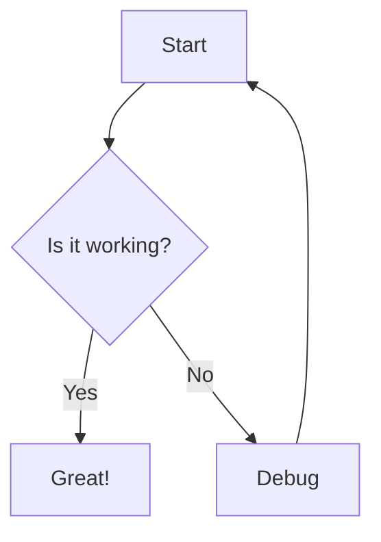

# Task: Mermaid Diagram Support

**Status**: Planned
**Priority**: Medium-High
**Estimated Effort**: 9-13 hours (core features)

---

## Overview

Implement Mermaid diagram rendering in both Reading Mode and Live Preview mode with interactive toggle functionality.

---

## Requirements

### 1. Reading Mode Integration
- Detect code blocks with `mermaid` language identifier
- Render Mermaid diagrams in place of code blocks
- Handle rendering errors gracefully
- Support all Mermaid diagram types

### 2. Live Preview Mode Integration (Primary Focus)
- Show rendered diagram by default when cursor is NOT in the code block
- Display "View Code" button in top-right corner of diagram
- Click "View Code" to toggle to source code view
- Click outside code block returns to diagram view
- Similar behavior to other Live Preview formatting

### 3. Dependencies
- Add `mermaid` package (^10.x)

---

## Implementation Steps

### Phase 1: Reading Mode (2-3 hours)
1. Install mermaid package: `npm install mermaid@^10.0.0`
2. Update `webview/editors/readingMode.ts`:
   - Import mermaid
   - Initialize with theme configuration
   - Find `<code class="language-mermaid">` blocks
   - Replace with rendered SVG diagrams
3. Add error handling for invalid syntax

### Phase 2: Live Preview Base (3-4 hours)
1. Create mermaid rendering function in `webview/editors/livePreviewMode.ts`
2. Detect `FencedCode` nodes with `mermaid` language
3. Replace code block with rendered diagram when cursor is outside
4. Keep code visible when cursor is inside block

### Phase 3: Interactive Toggle (3-4 hours)
1. Create "View Code" button widget
2. Position button in top-right of diagram
3. Implement toggle state management
4. Handle click outside to return to diagram view
5. Smooth transitions between views

### Phase 4: Polish & Testing (1-2 hours)
1. Theme integration (match VS Code light/dark)
2. Error display for invalid mermaid syntax
3. Test with all diagram types
4. Performance optimization

---

## Testing Checklist

- [ ] Flowchart renders correctly in Reading Mode
- [ ] Sequence diagram renders correctly in Reading Mode
- [ ] Diagrams render in Live Preview when cursor outside
- [ ] "View Code" button appears on diagram hover
- [ ] Click "View Code" switches to source view
- [ ] Click outside returns to diagram view
- [ ] Invalid mermaid syntax shows error gracefully
- [ ] Theme matches VS Code light/dark mode
- [ ] Diagrams properly sized and scrollable

---

## Files to Modify

- `package.json` - Add mermaid dependency
- `webview/editors/readingMode.ts` - Add mermaid rendering
- `webview/editors/livePreviewMode.ts` - Add interactive diagram support
- `webview/lib/markdown-live-preview/plugin.ts` - Extend for mermaid blocks

---

## Example Usage

````markdown

````

**Expected behavior in Live Preview**:
- Cursor outside: Shows rendered diagram with "View Code" button
- Cursor inside: Shows markdown source code with syntax highlighting
- Toggle button: Allows switching between views

---

## Related Tasks

- See [Interactive Mermaid Live Preview](./interactive-mermaid-live-preview.md) for comprehensive implementation details
- Consider integrating with the `lib/markdown-live-preview` library for consistency

---

## Notes

- Use Mermaid v10+ which has better error handling and more diagram types
- Mermaid code execution should be sandboxed (use `securityLevel: 'loose'` only if necessary)
- Consider theme synchronization to match VS Code's active theme
- Widget-based approach recommended for full control over DOM structure
